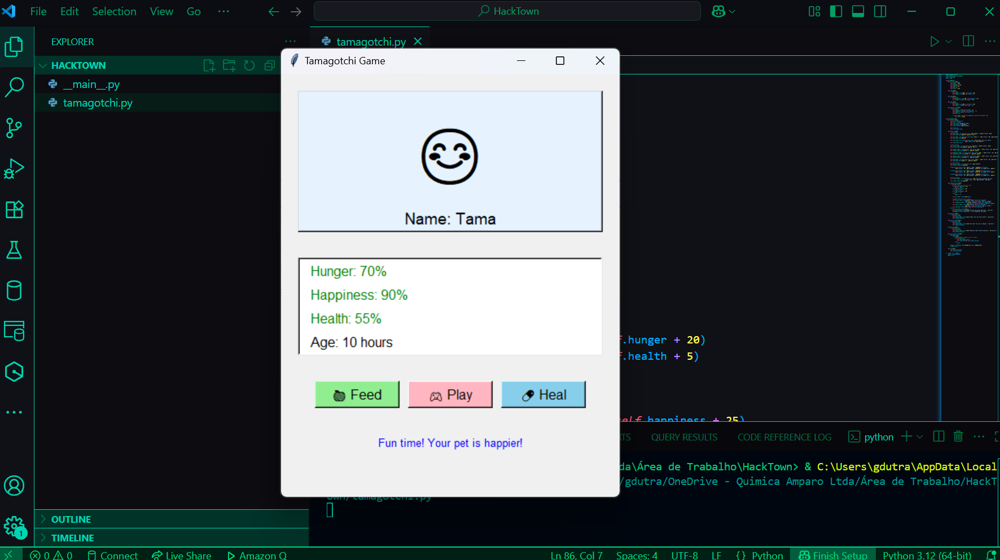
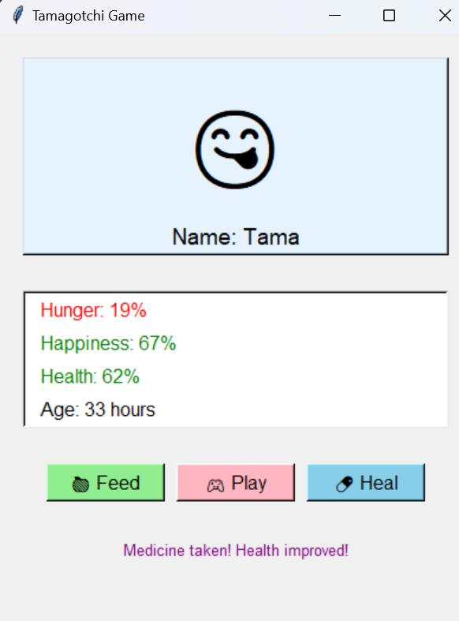
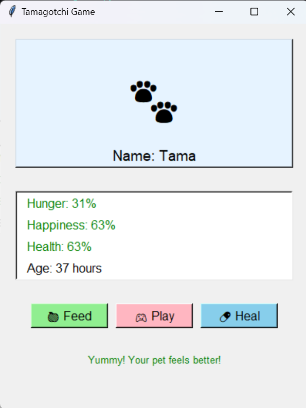
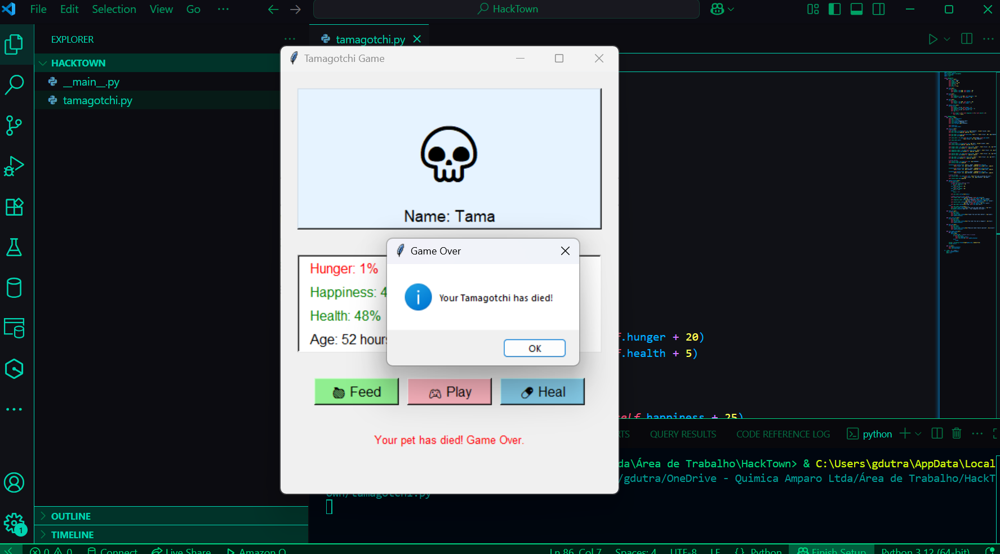

# 🐾 Tamagotchi Game

Um jogo simples de Tamagotchi desenvolvido pelo Gian Dutra usando Amazon Q Developer CLI para o HackTown 2025 de Santa Rita do Sapucai.

## 📋 Sobre o Projeto

Este é um jogo de pet virtual onde você precisa cuidar do seu Tamagotchi mantendo seus níveis de fome, felicidade e saúde. O pet envelhece com o tempo e suas necessidades aumentam, exigindo cuidado constante para mantê-lo vivo.

## 📸 Screenshots






## 🎮 Como Jogar

1. Execute o jogo:
   ```bash
   python tamagotchi.py
   ```

2. Cuide do seu pet usando os botões:
   - **🍎 Feed**: Aumenta a fome e saúde
   - **🎮 Play**: Aumenta a felicidade mas diminui a fome
   - **💊 Heal**: Aumenta a saúde mas diminui a fome

3. Monitore as estatísticas:
   - **Verde**: Níveis saudáveis
   - **Vermelho**: Níveis perigosos (abaixo de 30%)

4. **Game Over**: O pet morre se qualquer estatística chegar a 0%

## 🎮 Como Instalar Amazon Q Developer CLI no Windows

1. Execute o comando no cmd como adm: "wsl --install"  (Obs: é necessário ter o subsistema linux para windows)
2. sudo apt install unzip
3. curl --proto '=https' --tlsv1.2 -sSf https://desktop-release.codewh isperer.us-east-1.amazonaws.com/latest/q-x86_64-linux-musl.zip -o q.zip
4. unzip q.zip
5. cd q/
6. chmod +x install.sh
7. ./install.sh
   Após isso, você deve selecionar um método de entrada. No meu caso, selecionei a opção 1, "Use for free with Builder ID"
   

## 🛠️ Requisitos

- Python 3.x
- tkinter (incluído na instalação padrão do Python)

## 🎯 Funcionalidades

- Interface gráfica intuitiva
- Sistema de estatísticas em tempo real
- Emojis que mudam baseado no estado do pet
- Loop de jogo automático com atualizações a cada 5 segundos
- Sistema de cores para indicar níveis críticos

## prompt usado

/editor create a simple tamagotchi game using tkinter


## 👨‍💻 Desenvolvedor

**Gian Dutra**  
Desenvolvido para o evento **HackTown 2025** em Santa Rita do Sapucaí

---

*Mantenha seu Tamagotchi feliz e saudável! 🐾*
